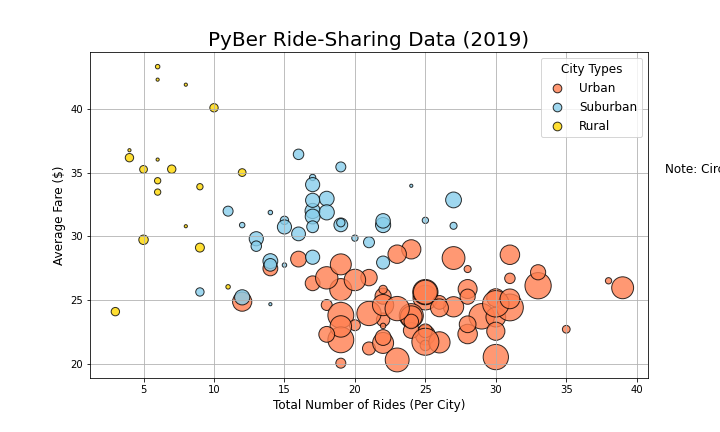
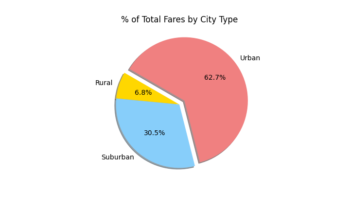
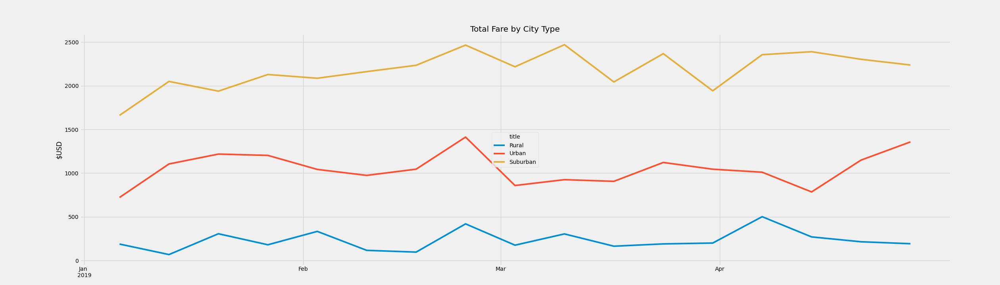

# PyBer_Analysis

## Overview
As a data analyst for Pyber, a Python-based ridesharing app company, we must analyze and visualize data from their ridesharing app. Our goal is to showcase different relationships between the type of city and the number of drivers, fares, and more. For this analysis, we must create a summary DataFrame of the ride-sharing data by city type. Then we must visualize it using MatPlotLib. 

## Results
There are multiple differences in ride-sharing data between the three city types: Urban, Suburban, and Rural. 

We can see that Urban cities dominate the ride count with 1625 total rides. This greatly overshadows Suburban  (625 rides) and Rural (125 rides) cities. The amount of drivers parallel the ride count, with Urban cities having 2405 drivers, Suburban cities having 490 drivers, and Rural cities having 78 drivers. This shows a positive correlation between population dense areas and app usage. 

The average fares show an inverse relationship with population density (total ride count). The average fares in Urban areas are the lowest at $24.53. Suburban areas reign in at number two with an average fare of $30.97. The highest average fare is in Rural areas at $34.62. Our analysts suspect that this is due to the longer ride distance in lower population density areas. 

  

This scatter plot shows the relation between the total number of rides per city (in each type) and the average fare. The larger the circle in the plot, the more rides there were in that city. This shows the negative relation between number of rides and average fares. 

  

This box plot shows the relation between city types and the number of rides. Once again, Urban cities have the highest average number of rides and Rural cities have the lowest. 

  

This pie chart shows the percentage of total fares by city type. Urban cities produce the most amount of fares at 62.7% of the fares, followed by Suburban at 30.5% and Rural at 6.8%.

  

This pie chart shows the percentage of total rides by city type. Unsurprisingly, Urban cities have the most rides at 68.4%, Suburban cities have 26.3%, and Rural cities have 5.3%.

  

This pie chart shows the percentage of drivers by city type. Urban cities have the most drivers at 80.9% of total drivers, Suburban cities have 16.5%, and Rural cities have 2.6%.

  

From this data, we can see that Urban cities with high population density have the most drivers, rides, and total fares. These results decrease in Suburban cities, and decrease further in Rural cities. The average fare, however, is negatively correlated with population density. As the population density decreases, the average fare increases. This means that Rural cities have the highest average fares, and Urban cities have the lowest. 

## Summary
After extrapolating this data, a few proposals can be made to the company to address the disparities among the city types.

### Proposal One
We propose that the company provides driver incentive to ride-share in Rural and Suburban cities. The total fares for Rural and Suburban cities combined are less than half of the total fares of Urban cities. We believe that this is due to the smaller number of drivers for Rural and Suburban cities. Advertisements could be made to drivers that the individual fares are higher in Rural and Suburban cities to incentivise ride-sharing in lower population areas. 

### Proposal Two
If the lower total fares is not due to the lack of drivers, but instead the lack of customers, we recommend focusing our advertising in those areas. Perhaps a coupon off an individual's first ride would incentivise customers in lower-population areas to utilize our platform over our competitors. 

### Proposal Three 
Based on our Total Fare by City Type graph, we can see that the total fares spike in all three city types toward the end of February. These spikes repeat but decrease in intensity until the end of March, then shoot up again in the first half of April. If we incentivised more drivers to use our platform during those periods of high usage, we would see more fares. 
